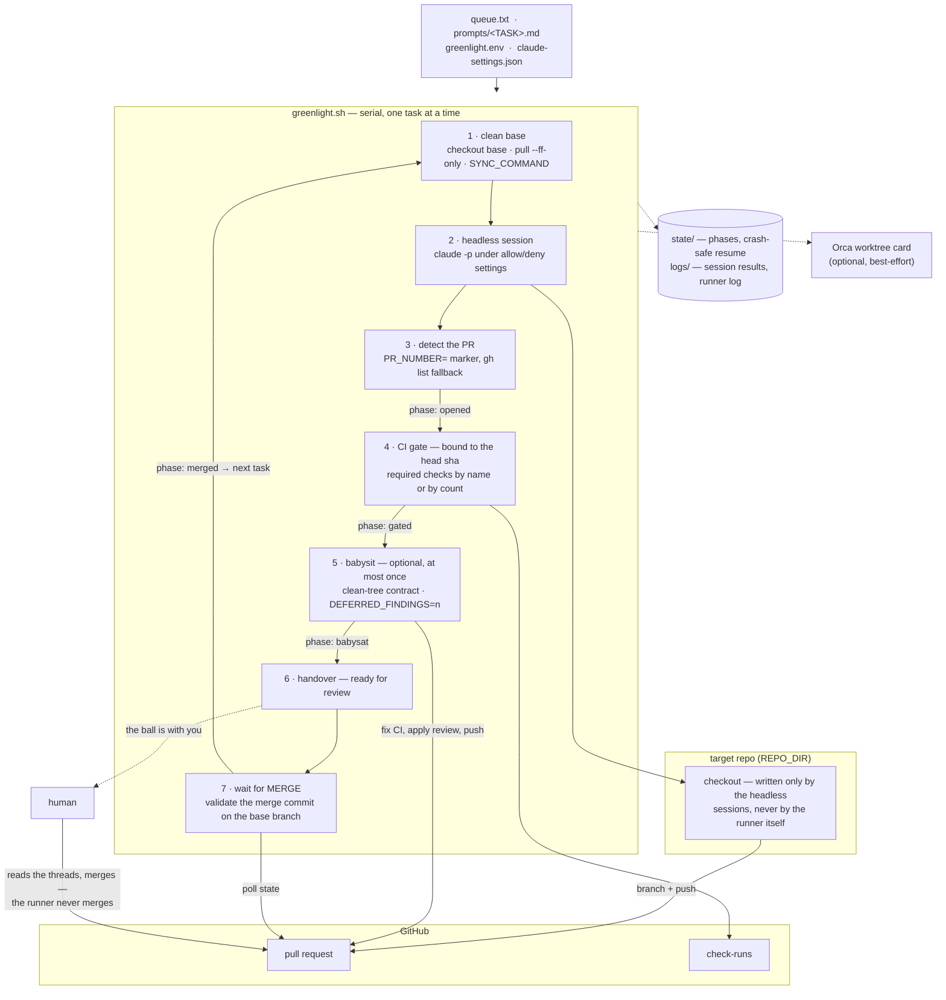

# greenlight

Serial task queue for headless Claude Code. Agents implement tasks and open PRs, CI gates by
name or by count, and **nothing merges without a human**.

```
queue.txt ─▶ for each task ─▶ clean base ─▶ claude -p < prompts/TASK.md ─▶ detect PR
          ─▶ CI gate (sha-bound) ─▶ [babysit once] ─▶ hand over to a human ─▶ wait for MERGE
          ─▶ validate merge on the base branch ─▶ next task
```

One task = one fresh headless session, run serially on a single checkout, so every task starts
from the base branch **with** the previous task merged. State lives in `state/`, so a crash or a
`kill` resumes exactly where it stopped without re-running finished work.

Current version: **v0.3.0** (`./greenlight.sh --version`) — history in [CHANGELOG.md](CHANGELOG.md).

Everything lives **outside** the target repo. The repo is only the target of operations
(`REPO_DIR`); the runner never writes inside it.

## Architecture



Two properties the diagram encodes: the runner and all of its files live **outside** `REPO_DIR`
(only headless sessions write to the checkout), and the loop has exactly one exit per task — a
**human** merging the PR. Phases land in `state/prs.txt` as they happen, which is what makes a
crash or a `kill` resumable.

## Requirements

`bash` 3.2+ (macOS default works), `git`, `gh` >= 2.30 (authenticated), `jq` >= 1.6, `perl`,
`claude` (Claude Code CLI). Optional: the `orca` CLI for progress reporting on an Orca ADE
worktree card — reporting is **off by default**; set `ORCA_ENABLED=1` to turn it on. Not an
Orca user? There is nothing to configure.

## Quick start

```bash
git clone <repo-url> greenlight
cd greenlight
cp examples/greenlight.env.example greenlight.env     # set REPO_DIR at minimum
cp examples/queue.example.txt queue.txt
mkdir -p prompts && $EDITOR prompts/TASK-101.md        # see docs/prompt-contract.md

./greenlight.sh queue.txt --dry-run     # prints the plan; no claude session, no gh writes
./greenlight.sh queue.txt               # runs
nohup ./greenlight.sh queue.txt > logs/run-$(date +%F).out 2>&1 &   # in the background
```

`--dry-run` is not dependency-free: it still needs `claude` and `gh` on PATH and a clean
`REPO_DIR` checkout — only `gh auth status` and the writes are skipped. On macOS, prefix the
background run with `caffeinate -is` so a sleeping laptop does not pause the merge polling.

Stop a running queue with `kill -TERM $(cat state/runner.pid)`. Resume by running the same
command again. See [docs/runbook.md](docs/runbook.md).

The runner works from any cwd: paths default relative to the directory that holds
`greenlight.sh`, and a relative `REPO_DIR` or queue path is resolved against the caller's cwd.

## Configuration

All settings are environment variables. Put them in `greenlight.env` next to the script (loaded
automatically, gitignored), in any file passed with `--env <file>`, or in the shell. Precedence:
flags > shell environment > env file.
[examples/greenlight.env.example](examples/greenlight.env.example) lists every variable with its
default and a full worked example.

| setting | default | effect |
|---|---|---|
| `REPO_DIR` / `--repo-dir` | *(required)* | target checkout |
| `BASE_BRANCH` | `main` | branch tasks start from and PRs target |
| `QUEUE_FILE` / first argument | `./queue.txt` | the queue |
| `PROMPTS_DIR`, `STATE_DIR`, `LOGS_DIR` | `./prompts`, `./state`, `./logs` | runner files |
| `SETTINGS_FILE` | `./claude-settings.json`, else the example | allow/deny for headless sessions |
| `SYNC_COMMAND` | *(empty)* | run in `REPO_DIR` after each clean base (install, codegen) |
| `CHECKS_MODE` | `count` | `count` \| `names` \| `list` — see below |
| `BABYSIT_COMMAND` | *(empty = skip)* | run once per PR after the first green gate |
| `BABYSIT_DELAY_S` | 0 s | wait between the green gate and the babysit (late review bots) |
| `POLL_INTERVAL` / `--poll-interval` | 60 s | merge polling interval |
| `TASK_TIMEOUT_S` / `--task-timeout` | 3600 s | ceiling per task session |
| `BABYSIT_TIMEOUT_S` / `--babysit-timeout` | 1800 s | ceiling for the babysit command |
| `--skip-babysit` / `SKIP_BABYSIT=1` | off | skip the babysit even when configured |
| `ORCA_ENABLED` | `0` | `1` reports progress to an Orca ADE worktree card |

## The CI gate

The gate is one function and its evidence is bound to a **sha**, not to the PR rollup:

1. Pin the PR's `headRefOid`.
2. Wait for check-runs of that sha to **exist** (right after a push the list is empty).
3. `gh pr checks --watch --fail-fast` (red aborts the queue; nothing reviews code that is still changing).
4. Re-read the head; if it moved during the gate, abort and ask for a rerun.
5. Validate the check-runs of the pinned sha according to `CHECKS_MODE`:

| mode | config | rule |
|---|---|---|
| `count` (default) | `MIN_CHECKS=1` | at least N `success`, none failed. Warns on every gate: a renamed or removed job still "passes". |
| `names` | `CHECKS_SOURCE` (file in the target repo) + `CHECKS_JQ_FILTER` | each name must exist on the sha with `conclusion=success` |
| `list` | `REQUIRED_CHECKS="build,lint,e2e"` | same, from a literal list |

A required check that is **absent** on the sha fails the gate. "Green by absence" is the failure
mode name-based gating exists to catch.

## Babysit (optional, at most once, before handover)

`BABYSIT_COMMAND` runs in `REPO_DIR` once per PR, with `PR_NUMBER`, `TASK_ID`, `REPO_DIR`,
`BASE_BRANCH`, `SETTINGS_FILE` and `GREENLIGHT_DIR` exported. Typical use: a second headless
session that fixes red CI and applies objective review-bot comments, then pushes. If the head
moved, the full gate re-runs on the new sha. The phase is recorded before the re-gate, so a rerun
never repeats the babysit. Empty command = skipped with a log line.

Two contract clauses apply to the command (details in [docs/prompt-contract.md](docs/prompt-contract.md)):
it must exit with a clean tree (otherwise the runner saves the leftover diff and stops), and it may
print `DEFERRED_FINDINGS=<n>` for review findings it left to the author, which changes the handover
message to "ready, with n deferred finding(s) awaiting your judgment". Findings never block the
merge; they are surfaced so the human reads the threads before deciding.

## Headless permissions

Sessions run with `--settings <SETTINGS_FILE>` (the example is a sane starting point). The
`deny` list is what makes "nothing merges without a human" true for the agent: `gh pr merge`,
`gh pr close`, force push, push to the base branch, `git reset --hard`, `git clean`, and reading
`.env*`/credential files. `deny` wins over any `allow` in the target repo's own settings.

The permission matcher matches by **form**, and several common shapes are denied even when
every command in them is allowed. Read the gotchas in [docs/runbook.md](docs/runbook.md#headless-shell-gotchas)
before writing prompts.

## Auto-merge is a design decision, not a missing feature

greenlight will not merge a PR, and will not grow a flag to do so. A green gate is a
precondition for handover, not proof of readiness: a review bot can defer a finding to the
author, a renamed job can turn a gate green by absence, and only a human reads the threads.
The runner's job ends at "the ball is with you". See [docs/design.md](docs/design.md#non-goals)
before opening an issue or PR that adds merging.

## Contributing

Issues and PRs are welcome for bugs, portability (bash 3.2 stays a requirement), new
`CHECKS_MODE` sources and doc fixes. CI runs `bash -n` and `shellcheck` on every PR. For any
change to the runner itself, run the full regression smoke: [docs/testing.md](docs/testing.md)
ships the harness (scratch-repo workflow, smoke prompts, stubs).

## Docs

- [docs/runbook.md](docs/runbook.md) — stop, resume, phase table, failure modes, state cleanup, shell gotchas.
- [docs/prompt-contract.md](docs/prompt-contract.md) — what a task prompt must do for the runner to pick up its PR.
- [docs/design.md](docs/design.md) — invariants, phase machine, why the gate is sha-bound, squash-merge validation.
- [docs/testing.md](docs/testing.md) — the regression smoke harness: scratch repo, prompts, stubs, run matrix.

## License

MIT — see [LICENSE](LICENSE).
